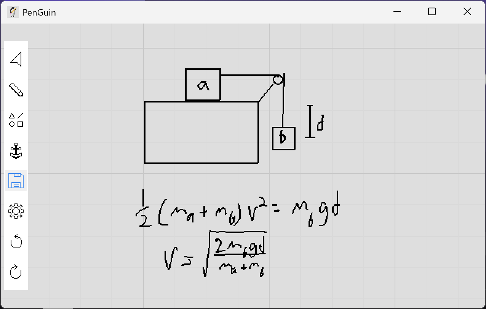

# PenGuin


PenGuin is an opensource Python drawing application designed for STEM note taking and problem solving. This application is meant to be light weight, easy to use and easily modifiable. 

## How to run

The project is still development so there is not a compiled executable. To run the demo, ensure python is downloaded on your machine. This project uses 3.13.7, but should be compadible with mose versions. After this, also run the following commands to isntall the dependencies. 
```
pip install pygame
pip install numpy
pip install pickle5
pip install easygui
```

Then, run the `main.py` file. If there are any issues running, it is most likely because the `path` variables in the `constants.py` file is incorrect. If you are not using VSCode or another IDE that sets the working directory to the root folder, change the path variables to `../`.   

## How to use



### Basic Drawing

To adjust the viewport, right click to move around and scroll to scale. The pen tool allows you to create new freehand shapes. The select tool allows move or delete shapes you already made. The shape tool allows you to select a shape to create. These tools can be accessed with the buttons or shortcuts described below. 

### Shortcuts

Below are the shortcuts currently implemented. 

* `s` use select tool.
* `p` use pen tool.
* `l` use line tool.
* `r` use rectangle tool.
* `c` use circle tool.
* `e` use elipse tool.
* `a` set anchor.
* `g` go to set anchor.
* `h` hide / show tool bar. 
*  `ctrl` + `z` undo your last edit.
* `ctrl` + `y` redo your last edit.

### Exporting

Currently the program supports exporting to `.nts` format. `.nts` files allow you to reimport your work inside the program. In the future, we plan on adding functionality to the `.png` and `.pdf` buttons, which will allow you to export to formats that can be viewed independently of the PenGuin application. 

## Contributions

If you are interested in contributing to the projet, email Ethan Roger at bay2uu@virginia.edu
  
